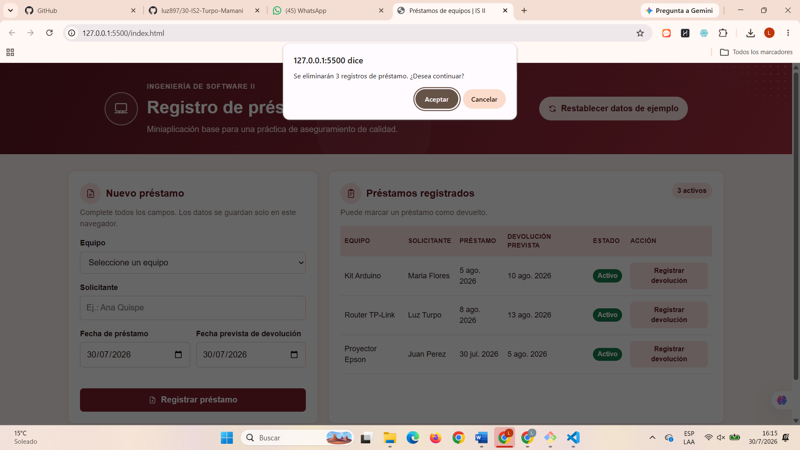
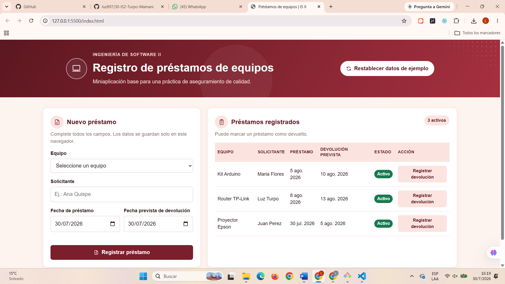

# Préstamos de equipos  Aplicación para Ingeniería de Software II

Miniaplicación estática para la actividad individual de aseguramiento de calidad de software. No usa base de datos ni servidor, guarda los registros en el navegador mediante `localStorage`.

## Funcionalidad inicial

- Registra un préstamo de un equipo disponible.
- Evita registrar datos incompletos, una fecha de devolución anterior a la fecha de préstamo y el préstamo simultáneo del mismo equipo.
- Muestra los préstamos y permite registrar la devolución.
- Conserva los datos del navegador mientras no se restablezcan desde la aplicación.

## Inicio rápido

1. Copie esta carpeta a su repositorio individual o use el repositorio base como plantilla.
2. Abra `index.html` en el navegador para probarla localmente.
3. Implemente únicamente la mejora asignada en su ficha.
4. Registre dos casos de prueba en la sección final de este README.
5. Publique la aplicación en GitHub Pages y proporcione los enlaces solicitados.

## Archivos principales

- `index.html`: estructura y controles de la aplicación.
- `style.css`: diseño visual.
- `app.js`: catálogo, registros, validaciones y almacenamiento local.

## Casos de prueba de mi mejora

**Mejora implementada:** Restablecimiento con cantidad afectada — el botón "Restablecer datos de ejemplo" informa cuántos registros se eliminarán antes de confirmar la acción.

| Caso | Datos de entrada / acción | Resultado esperado | Resultado obtenido | Estado |
|---|---|---|---|---|
| CP-01: caso válido | Con 3 préstamos registrados en la tabla, hacer clic en "Restablecer datos de ejemplo". | El sistema debe mostrar un mensaje indicando la cantidad correcta de registros a eliminar antes de confirmar. | El cuadro de confirmación mostró "Se eliminarán 3 registros de préstamo. ¿Desea continuar?", coincidiendo con la cantidad real de préstamos registrados. | Aprobado |
| CP-02: caso de cancelación | Con 3 préstamos registrados en la tabla, hacer clic en "Restablecer datos de ejemplo" y luego en "Cancelar" en el cuadro de confirmación. | Al cancelar, los datos deben mantenerse sin ningún cambio. | La tabla siguió mostrando los mismos 3 préstamos (Kit Arduino, Router TP-Link, Proyector Epson), todos en estado "Activo", sin ninguna modificación. | Aprobado |

### Evidencia de las pruebas

**CP-01 - El mensaje indica la cantidad correcta:**

**CP-02 - Al cancelar se mantienen los datos:**

## Entrega

- URL del repositorio individual.
- URL pública de GitHub Pages.
- README actualizado con los dos casos de prueba.
